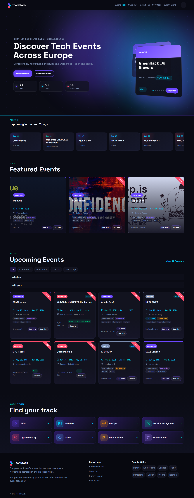
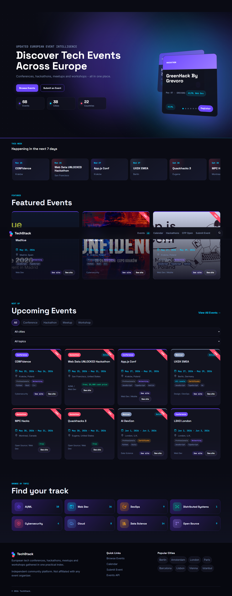
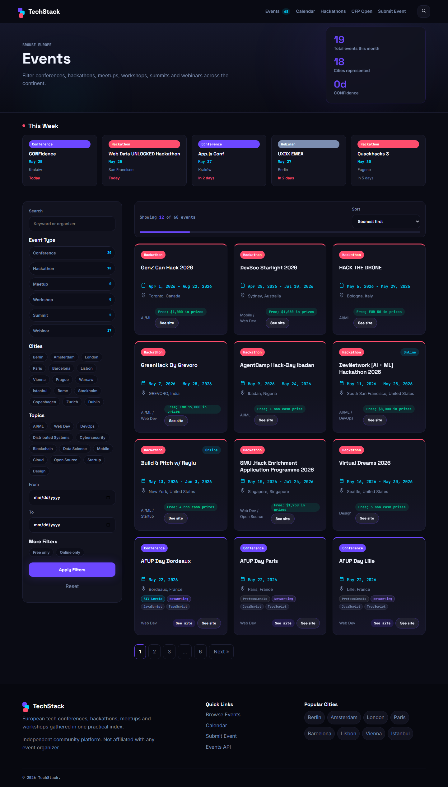
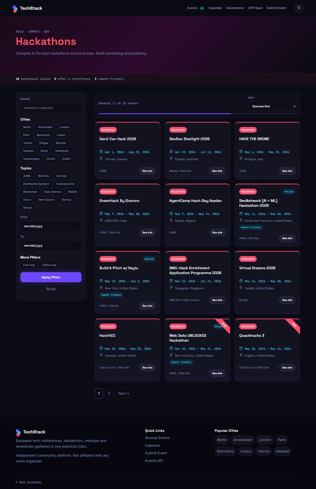
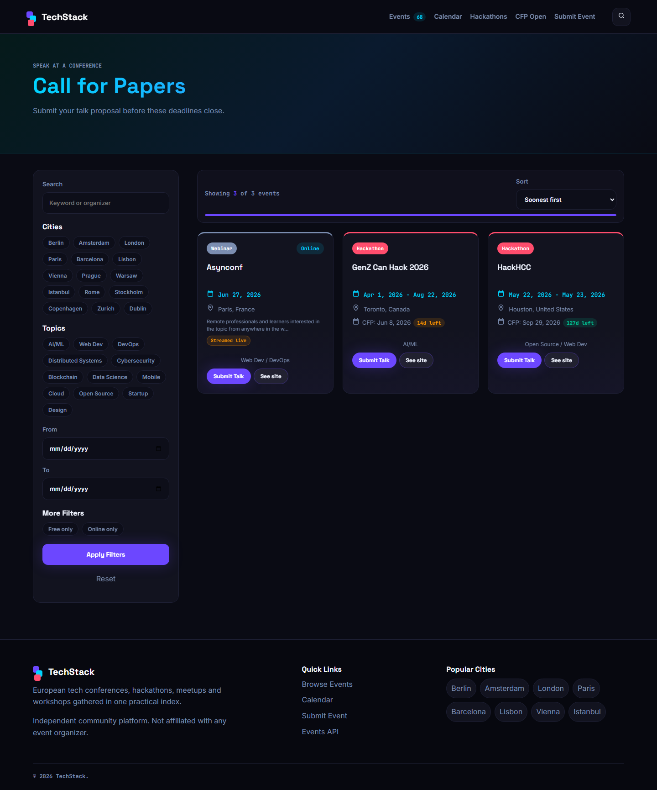
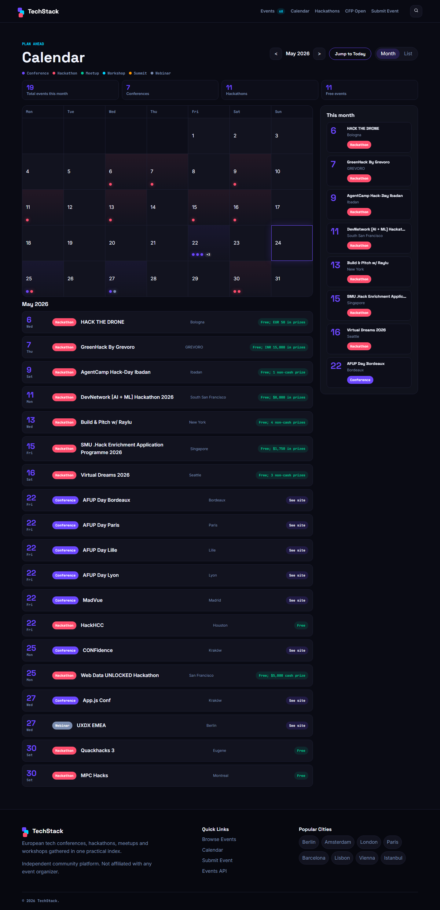
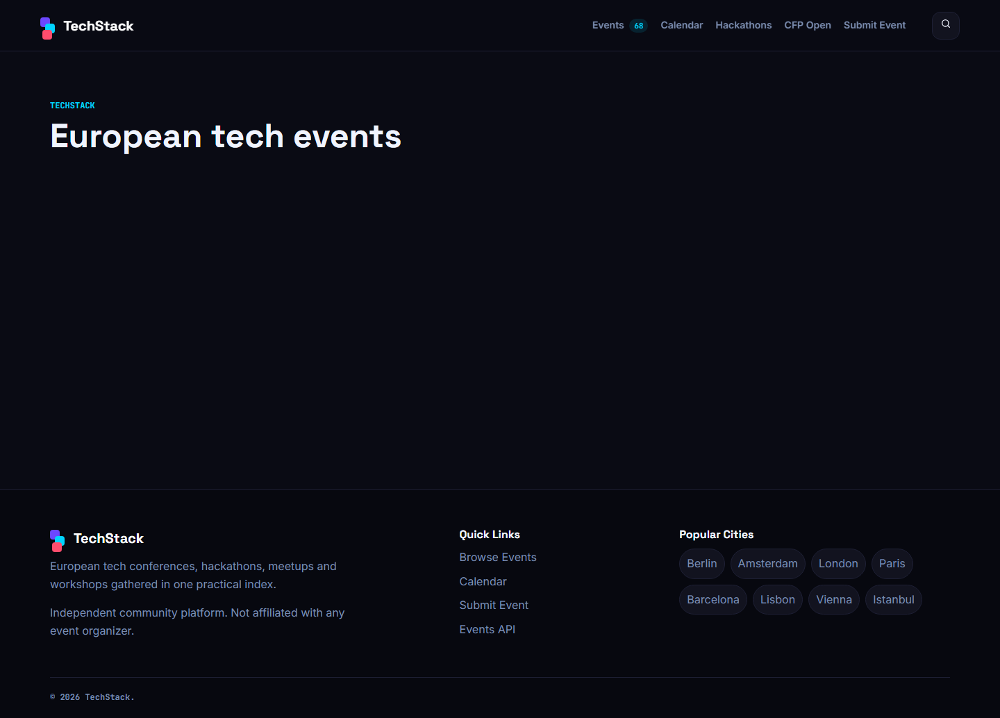
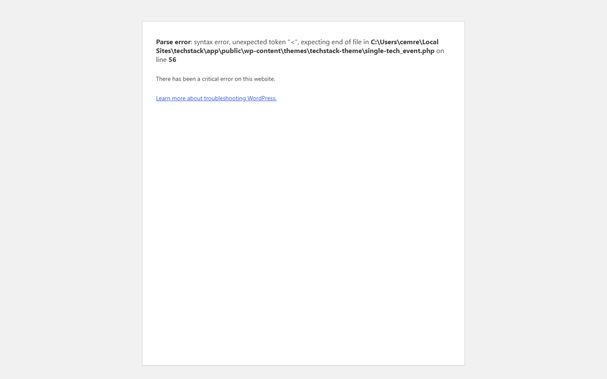

# TechStack

A WordPress theme for discovering and tracking European tech events. Aggregates conferences, hackathons, meetups, workshops, summits and webinars into a single filterable index.

68 real events across 20+ cities sourced from confs.tech, devpost.com, lablab.ai, and mlh.io.

## Screenshots

### Homepage

### Featured Events

### Browse by Topic

### Events Archive

### Hackathons

### CFP Open

### Calendar

### Submit Event

### Navigation Flow

Clicking an event card navigates to the single event detail page.

The See Site button links directly to the event registration or official website.

## What it does

Aggregates real European tech events from public sources. Displays them in a filterable archive with sidebar filters for event type, city, topic, date range, price, and online status. Separate pages for hackathons and open call-for-papers submissions sorted by deadline urgency. A monthly calendar view with event type color coding and day popovers. A public submission form for community-contributed events that creates a draft for admin review.

## Pages

- Events — filterable archive with 320px sidebar, type pills, city and topic filters, date range, sort options
- Hackathons — pre-filtered view with team and prize context, red-purple hero
- CFP Open — speaker submission deadlines sorted by urgency, cyan-navy hero, deadline countdown badges
- Calendar — monthly grid with colored dots per event type, day popovers, this-month stats bar, list view
- Submit Event — two-column form with toggle cards for online/hybrid format, topic pills, success state

## Event cards

Each card shows event type badge, name, date in JetBrains Mono, location, audience level, certificate badge if offered, programming language pills, networking badge, scholarship badge. Top border color matches event type. Starting soon ribbon for events within 7 days.

## Stack

- WordPress 7.0
- PHP 8.2
- Advanced Custom Fields with 30+ fields per event
- Custom standalone theme, no parent theme, no page builder
- LocalWP for local development
- Playwright for screenshot automation

## Custom post type

`tech_event` with fields covering: dates, location, format (online/hybrid/in-person), topics, organizer, price, registration URL, CFP deadline and URL, audience level, certificate, programming languages, speaker count, networking, scholarships, live stream, remote friendly, past editions count.

## Data

All events are real. Sources: confs.tech, devpost.com, lablab.ai, mlh.io, eventbrite. No generated or placeholder content. Events outside Europe were excluded.

## Local setup

1. Install LocalWP and create a site named `techstack`
2. Copy this theme folder to `wp-content/themes/`
3. Install and activate Advanced Custom Fields plugin
4. Activate the theme
5. Go to Settings > Permalinks and save
6. Import event data via the included WP-CLI scripts or trigger manually

The database is not included in this repository. After setup the site will be empty until data is imported.

## Author

Cemre Mete — cemremete.dev
